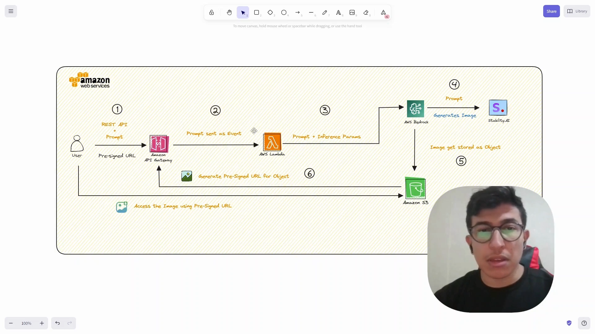

# aws-movie-poster-creator
AWS Movie Poster Creator leverages AWS Lambda and Bedrock's Stability Diffusion Model to generate dynamic movie posters. It stores images in S3, manages access via API Gateway, and provides secure URLs for viewing. Includes all necessary scripts and API definitions.

## Table of Contents

- [🌟 Project Overview](#aws-movie-poster-creator)
- [🎬 Movie Poster Design - Broad Implementation Steps](#steps)
- [🏛 Architecture Overview](#architecture-overview)
- [🚀 Use Case Implementation Pre-Requisites](#use-case-implementation-pre-requisites)
- [🎥 Demo Video](#demo-video)
- [🔒 License](#license)

## 🏛 Architecture Overview

Below is the architectural diagram for the AWS Movie Poster Creator:


## 🎬 Movie Poster Design - Broad Implementation Steps

This section outlines the implementation steps for the "Movie Poster Design" feature, which uses AWS services to generate and serve custom movie posters based on user prompts.

### Step 1: Create an S3 Bucket

- **Bucket Name**: `movieposterdesign3467` (you would need to choose an other unique name, as the Bucket Name in aws should be unique accross all accounts)
- **Purpose**: This bucket will store the generated movie posters.

### Step 2: Create an AWS Lambda Function

- **Function Name**: `moviePosterDesignFunction`
- **Responsibilities**:
  1. **Connect to AWS Bedrock**: Utilize the Stability Diffusion Model to generate an image based on the user-provided prompt.
  2. **Store the Image**: Save the generated image as an object in the S3 bucket.
  3. **Generate a Pre-Signed URL**: Create a pre-signed URL for the generated image to ensure secure, temporary access.
  4. **Send the URL**: Respond to requests via AWS API Gateway with the pre-signed URL of the generated image.


### Step 3: Grant the right permissions to S3 Bucket & Lambda function (IAM Role)

1. **IAM Role**: Create an IAM Role with the following policies attached for necessary permissions:
   - **AmazonBedrockFullAccess**: Grants full access to Bedrock services.
   - **AmazonS3FullAccess**: Grants full access to Amazon S3.

2. **Timeout Settings**: Configure the AWS Lambda function timeout settings to accommodate the time taken by Bedrock API to generate images.


### Step 4: Create a REST API using AWS API Gateway

- **API Name**: `moviePosterDesignAPI`
- **Functionality**: Allow users to submit a prompt and return a pre-signed URL to view the generated image.
- **How it works**:
  1. **Receive Prompt**: Users pass the image generation prompt through the API.
  2. **Return Image URL**: Users receive a pre-signed URL to access the image securely.

### Step 5: Test Using Postman API Tool

- **Testing**: Use Postman to send requests to the `moviePosterDesignAPI` and ensure the entire flow from prompt submission to image retrieval via the pre-signed URL functions correctly.

## 🚀 Use Case Implementation Pre-Requisites

Upgrade Boto3 version and configure AWS Lambda for advanced features.

### Boto3 Version Upgrade Steps

1. **Create AWS Lambda Function**
   - **Function Name**: `bedrock-boto3Upgrade`
   - **Code**: Include `import boto3` at the beginning of your script.

2. **Verify Boto3 Version**
   - Use the following command to check your current boto3 version:
     ```python
     print(boto3.__version__)
     ```
   - Ensure that the version is greater than `1.28.63`.

3. **Upgrade Boto3 Using Lambda Layer**
   - Reference for handling Python runtime errors in AWS Lambda: [AWS Knowledge Center](https://repost.aws/knowledge-center/lambda-python-runtime-errors)
   - **Steps**:
     - Add Layer Version ARN to your Lambda function.
     - Verify that the updated version is greater than `1.28.63`.

4. **Manual Creation of a Lambda Layer for Boto3**
   - **Directory Setup**:
     ```bash
     LIB_DIR=boto3-udemy03/python
     mkdir -p $LIB_DIR
     ```
   - **Install Boto3**:
     ```bash
     pip3 install boto3 -t $LIB_DIR
     ```
   - **Create Zip File**:
     ```bash
     cd boto3-udemy03
     zip -r /tmp/boto3-udemy03.zip .
     ```
   - **Publish the Layer**:
     ```bash
     aws lambda publish-layer-version --layer-name boto3-udemy03 --zip-file fileb:///tmp/boto3-udemy03.zip
     ```

5. **Invoke Bedrock From AWS Lambda**
   - **Documentation**: [Bedrock Boto3 API Reference](https://boto3.amazonaws.com/v1/documentation/api/latest/reference/services/bedrock-runtime.html)

**Note**: If you're still struggling to install py dependecies into aws lambda, Please check out  this video :

[](http://www.youtube.com/watch?v=iluJFDUh-ck "How to install a Python Dependency on AWS Lambda (2023)")

## 🎥 Demo Video

Watch the demo video below to see the AWS Movie Poster Creator in action:

[](https://github.com/nour3467/aws-movie-poster-creator/assets/your_video_file.mp4)

## 🔒 License

This project is licensed under the [GNU GPL Version 2](https://www.gnu.org/licenses/old-licenses/gpl-2.0.en.html).
