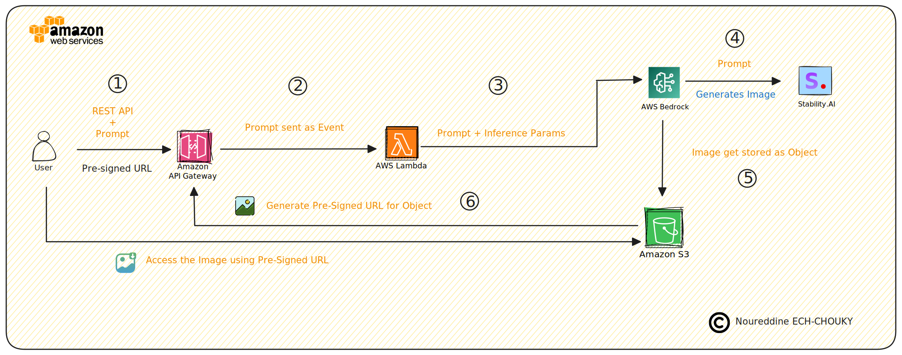

# aws-movie-poster-creator
AWS Movie Poster Creator leverages AWS Lambda and Bedrock's Stability Diffusion Model to generate dynamic movie posters. It stores images in S3, manages access via API Gateway, and provides secure URLs for viewing. Includes all necessary scripts and API definitions.

## Table of Contents

- [🌟 Project Overview](#aws-movie-poster-creator)
- [🎬 Movie Poster Design - Broad Implementation Steps](#steps)
- [🏛 Architecture Overview](#architecture-overview)
- [🎥 Demo Video](#demo-video)
- [🔒 License](#license)

## 🏛 Architecture Overview

Below is the architectural diagram for the AWS Movie Poster Creator:

## 🎬 Movie Poster Design - Broad Implementation Steps

This section outlines the implementation steps for the "Movie Poster Design" feature, which uses AWS services to generate and serve custom movie posters based on user prompts.

### Step 1: Create an S3 Bucket

- **Bucket Name**: `movieposterdesign01`
- **Purpose**: This bucket will store the generated movie posters.

### Step 2: Create an AWS Lambda Function

- **Function Name**: `moviePosterDesignFunction`
- **Responsibilities**:
  1. **Connect to AWS Bedrock**: Utilize the Stability Diffusion Model to generate an image based on the user-provided prompt.
  2. **Store the Image**: Save the generated image as an object in the S3 bucket.
  3. **Generate a Pre-Signed URL**: Create a pre-signed URL for the generated image to ensure secure, temporary access.
  4. **Send the URL**: Respond to requests via AWS API Gateway with the pre-signed URL of the generated image.

### Step 3: Create a REST API using AWS API Gateway

- **API Name**: `moviePosterDesignAPI`
- **Functionality**: Allow users to submit a prompt and return a pre-signed URL to view the generated image.
- **How it works**:
  1. **Receive Prompt**: Users pass the image generation prompt through the API.
  2. **Return Image URL**: Users receive a pre-signed URL to access the image securely.

### Step 4: Test Using Postman API Tool

- **Testing**: Use Postman to send requests to the `moviePosterDesignAPI` and ensure the entire flow from prompt submission to image retrieval via the pre-signed URL functions correctly.

These steps provide a comprehensive roadmap for setting up the movie poster generation feature, leveraging powerful AWS services to automate and secure the process.

## 🎥 Demo Video

Watch the demo video below to see the AWS Movie Poster Creator in action:

## 🔒 License

This project is licensed under the [GNU GPL Version 2](https://www.gnu.org/licenses/old-licenses/gpl-2.0.en.html).

